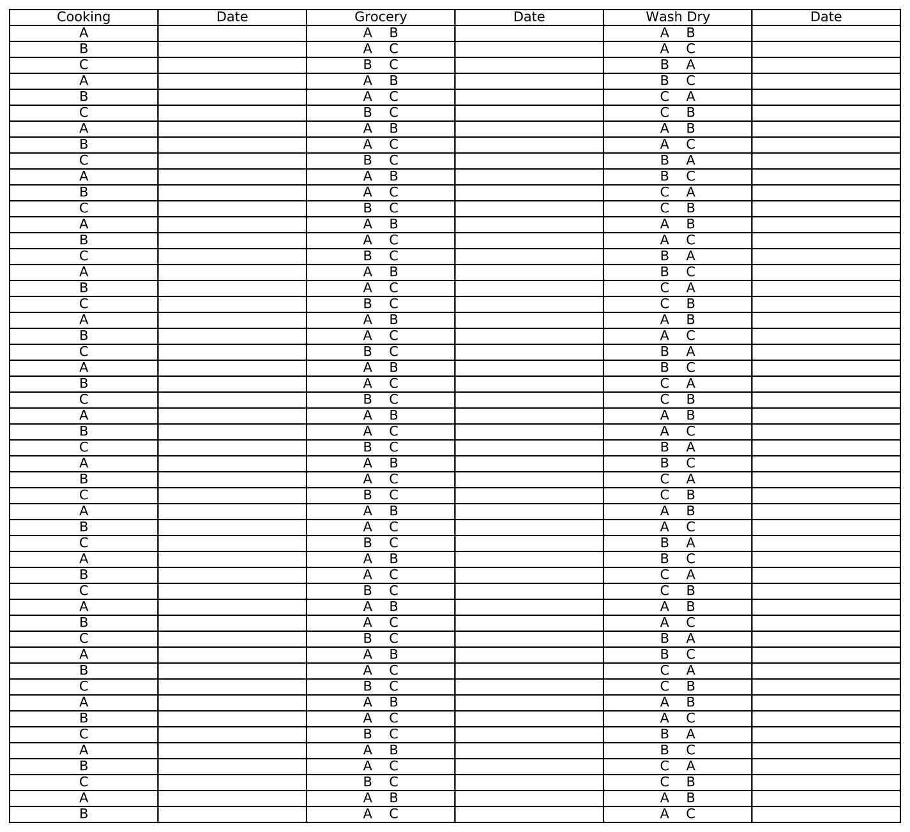

# Duty Chart Generator
This repository contains a utility for creating duty charts that is extremely helpful for
distributing household chores amongst the family or home members.

## Help on the argparse arguments
```
--initials INITIALS [INITIALS ...], -i INITIALS [INITIALS ...]
                    Enter the initials of the individuals e.g. A B C
--duty-columns DUTY_COLUMNS [DUTY_COLUMNS ...], -dc DUTY_COLUMNS [DUTY_COLUMNS ...]
                    Enter the duties e.g. Duty1 Duty2
--persons-per-duty-nos PERSONS_PER_DUTY_NOS [PERSONS_PER_DUTY_NOS ...], -ppd PERSONS_PER_DUTY_NOS [PERSONS_PER_DUTY_NOS ...]
                    Enter the persons per duty number i.e. how many of the people from the initials list would work at a time on a single duty.
--order_matters {yes,no} [{yes,no} ...], -om {yes,no} [{yes,no} ...]
                    This is a list of 'yes', 'no' values where the former means that the order matters in the grouping as in AB is different from BA and the latter means that the order does not matter.
```

## Create conda environment

```bash
conda env create -f environment.yml
```

## Usage

```bash
conda activate dutygen
python duty_chart_generator.py --init A B C -dc Cooking Grocery "Wash Dry" -ppd 1 2 2 -om no no yes
```


